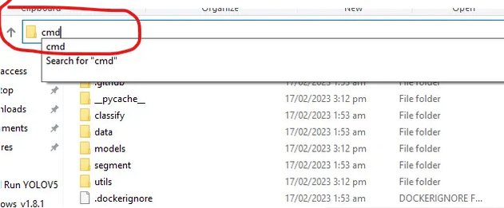

# Instructions for Demo 
The water meter image recognition uses YoloV5 (computer vision model). Model was trained with dataset found online and model weights exported as the file `watermeter.pt`.

## Usage on Windows
Assuming everything setup (YoloV5 downloaded, weights imported), proceed below:
1. Go to File Explorer.
2. Go to the YoloV5 folder (should be in Downloads).
3. Open the command prompt by selecting the entire text bar (should say something like This PC -> Desktop -> ...) and then replace it with the word `cmd` and press enter. See below for clarity:  

4. In the command prompt, enter `python ./detect.py --weights watermeter.pt --source "http://<ReplaceWithIP>:81/stream"`. This should open up the video stream and show the model image recognition part. This may take a few seconds so just wait. Replace `<ReplaceWithIP>` part with the ESP32-Camera IP which will be something like `192.168.1.12`.
5. To exit/kill the program, pressing X on the video stream may not end it. You need to go back to command prompt and then press `ctrl c` or force quit the command prompt to kill the process.

## Images used for testing
I put a few of the images that seemed to do okay with the model here: https://drive.google.com/drive/folders/19Lx49xkpTHNZbLAM0LcfYA5XxhkMY9mf?usp=drive_link.

