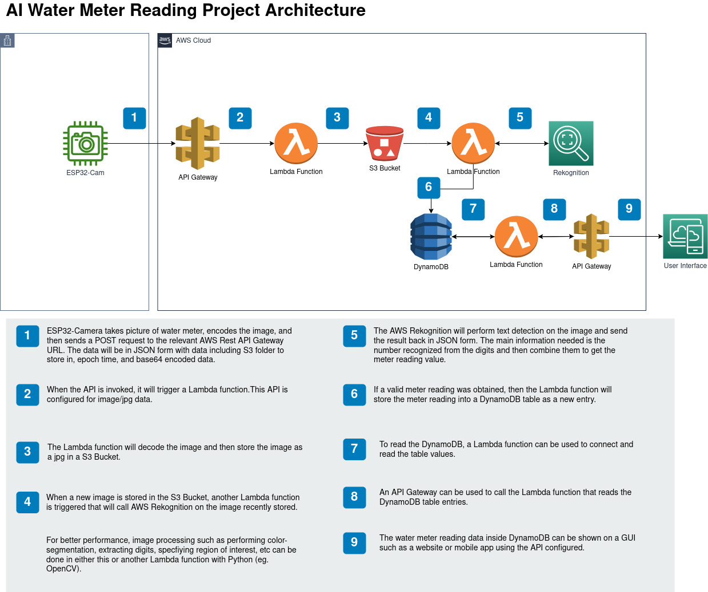

# Kolour Think Tank Internship
My internship project at Kolour Think Tank where I worked on reading the digital part of a utility meter such as a water meter using an ESP32-Camera and AWS services.

## Demo
Todo

## Documentation
Ongoing: [Link](./Documentation.md)

## Project Architecture


On the hardware side, the project uses ESP32-Camera for taking pictures and sending to AWS through Wi-fi with wireless functionality of ESP32 chip. On the software side, the ESP32-Camera prepares a JSON the following format:
```JSON
{
    "S3Folder": "Folder",
    "cropLeft": 0, 
    "cropTop": 0,
    "cropHeight": 0,
    "cropWidth": 0,
    "base64Image": ,
}
```

