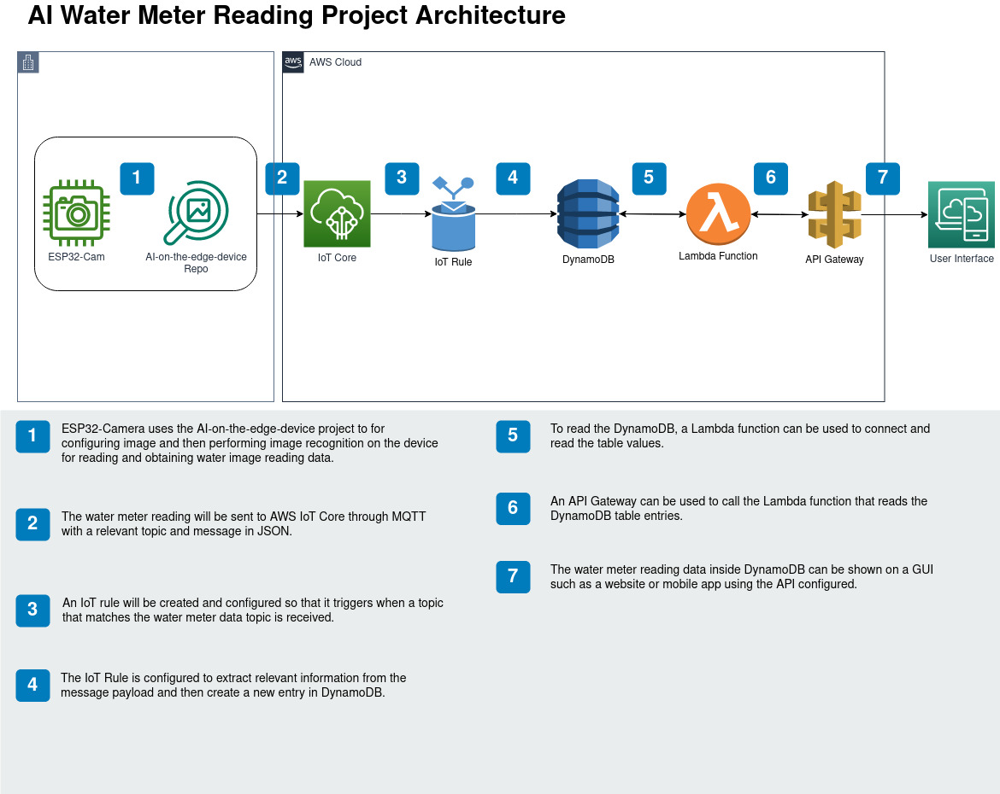

# Kolour Think Tank Internship
My internship project at Kolour Think Tank where I worked on reading a water meter using an ESP32-Camera and AWS services.

## Documentation
Ongoing: [Link](./Documentation.md)

## Project Architecture
There were 2 main approaches I considered when doing this project as shown below.

Approach 1 using text detection from AWS Rekognition:

Appoach 2 using AI-on-the

