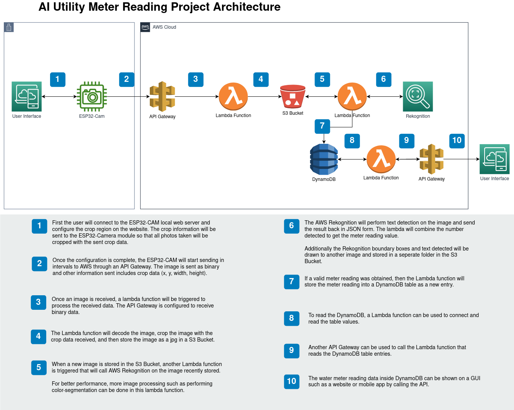

# Kolour Think Tank Internship
My internship project at [Kolour Think Tank](https://www.kolourthinktank.com/) where I worked on reading a digital utility meter (mainly focused on water meter) using an ESP32-Camera and AWS Rekognition and storing the readings in AWS DynamoDB.

## Demo
Todo

## Overview
For more details see [documentation](./docs/Documentation.md).
### Hardware Requirements
- ESP32-CAM (Most modules should work)
- ESP32-CAM-MB or USB to TTL (For uploading code)

### Software
- Frameworks: PlatformIO or Arduino IDE
    - Arduino-Libraries: Arduino-ESP32, ArduinoJSON, ESPAsyncWebServer
- AWS Services: Rekognition, Lambda, API Gateway, S3, DynamoDB

### Project Architecture

