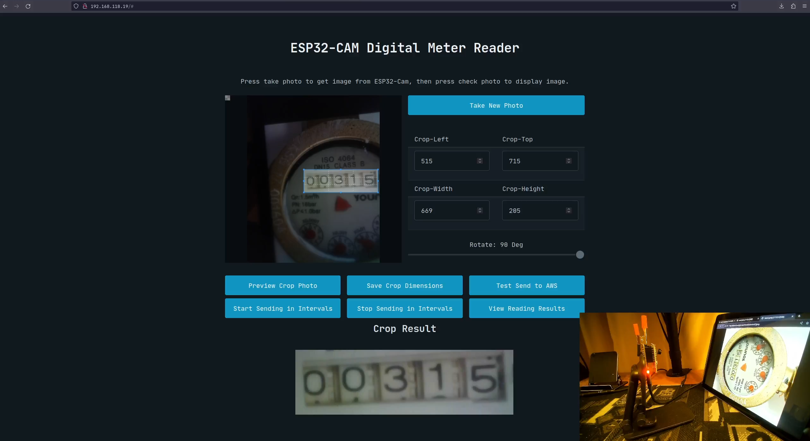

# ESP32CAM Meter Reading Project
My internship project at [Kolour Think Tank](https://www.kolourthinktank.com/) where I worked on reading a digital utility meter (mainly focused on water meter) using an ESP32-Camera and AWS Rekognition and storing the readings in AWS DynamoDB. 

Documentation [here](./docs/Documentation.md) alongside setup [video guide](https://youtu.be/pHNRqF-2EDg).

## Demo
[Video](https://youtu.be/pHNRqF-2EDg)
## Overview
### Project Architecture

### Hardware Requirements
- ESP32-CAM (Most modules should work)
- ESP32-CAM-MB or USB to TTL (For uploading code)

### Software
- Frameworks: PlatformIO or Arduino IDE
    - Arduino-Libraries: Arduino-ESP32, ArduinoJSON, ESPAsyncWebServer
- AWS Services: Rekognition, Lambda, API Gateway, S3, DynamoDB

For more details see [documentation](./docs/Documentation.md).

## Resources Used
- Documentation and Articles Used
    - [AWS Documentation](https://docs.aws.amazon.com/index.html)
    - Useful Rekognition Material:
        - [Text Detection Rekognition](https://docs.aws.amazon.com/rekognition/latest/dg/text-detecting-text-procedure.html)
        - [Analyze image from S3](https://docs.aws.amazon.com/rekognition/latest/dg/images-s3.html)
        - [Draw boundary boxes w/ Pillow](https://docs.aws.amazon.com/rekognition/latest/dg/images-displaying-bounding-boxes.html)
        - [Trigger Rekognition from S3](https://docs.aws.amazon.com/rekognition/latest/dg/images-lambda-s3-tutorial.html)
        - [Store Rekogniton result to DynamoDB](https://docs.aws.amazon.com/rekognition/latest/dg/storage-tutorial.html)
    - Creating API for DynamoDB Material:
        - [Building Serverless API w/ DynamoDB, API Gateway, Lambda](https://www.youtube.com/watch?v=Ut5CkSz6NR0&t=271s)
    - Creating API for Accepting Images:
        - [ESP32 Cam To AWS S3 Upload](https://www.youtube.com/watch?v=FIPkU-gx_kU&t=227s)
        - [Sharp Documentation](https://sharp.pixelplumbing.com/)
    - ESP32-CAM Code:
        - [Taking images, storing w/ SPIFFS, and sending it](https://randomnerdtutorials.com/esp32-cam-take-photo-display-web-server/) 

- Lambda Layer:
    - [Sharp](https://sharp.pixelplumbing.com/) (packaged layer [here](https://github.com/Umkus/lambda-layer-sharp))
    - [Python Pillow](https://pypi.org/project/Pillow/) (packaged layer [here](https://github.com/keithrozario/Klayers/tree/master/deployments/python3.8))
    

