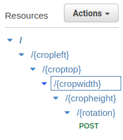

# AWS Setup
Make sure you have an AWS account. If you only have a root account, it is recommended to create an IAM user instead of using root. Also for this project I used US-East-1 region (N. Virginia), for easy setup make sure these services are in the same region. See [video guide](https://youtu.be/pHNRqF-2EDg) if not clear.

## Create AWS IAM User (if only have root)
Skip this if you already have an IAM User (but make sure you have correct permissions to Rekognition, Lambda, API Gateway, S3, DynamoDB) or really need to use root (not recommended for security reasons).

This is for quick setup, for better setup see [AWS Guide](https://docs.aws.amazon.com/IAM/latest/UserGuide/id_users_create.html).

1. In AWS Management Console, enter `IAM` in the search bar on the top and select `IAM` under Services. 

2. Click on `users` on the left bar, then click `create users`.

3. Enter a username, and select the `Provide user access to the – AWS Management Console` button. For quicker setup, click `I want to create an IAM User`. Below you can configure whether to have custom password and so on. Click next when done.

4. Click `Create Group`, enter a user group name, then for quick setup click `AdministratorAccess`. For better security with more control over user permission only give permissions to services used in this project (Rekognition, Lambda, API Gateway, S3, DynamoDB).

5. Click next and create user. Don't forget the password (can download credentials if needed).

6. Logout and login to your newly created IAM user.

## Create S3 Bucket
Go to S3 Bucket. Press `Create a Bucket`, give it a name, select a region, and then scroll down and press `create bucket`. You need to provide the Bucket name later in the Lambda code below.

## ESP32-CAM-Image-to-S3 Lambda Function
The first function is triggered when an image received from ESP32-CAM, where it will decode the image, crop the image with Sharp, and then store it in a S3 Bucket. Since this part uses Sharp which isn't included in Lambda, this [Lambda layer is used](https://github.com/Umkus/lambda-layer-sharp).

1. To setup, search and go to Lambda service. 

2. Press `create a function` and give it a name. 

3. Select `Node JS 16.x` runtime (as my code isn't up to date newest Node). Then press `Create Function`.

4. In Code Source, copy and paste the function The code is [here](../AWS/lambda_functions/uploadToS3.js). 

5. Press `deploy`.

6. We need to add a Lambda layer for Sharp. Go to [this repo](https://github.com/Umkus/lambda-layer-sharp/releases) and download the latest `sharp-layer.zip`.

7. Go back to AWS Lambda. On the left bar, press `layers` under `Additional Resources`. 

8. Press `Create Layer`, give it a name, press `upload` and upload the `sharp-layer.zip`. Then press `create`.

9. Go to `Functions` in left bar of Lambda and press into the function you created earlier. Scroll down till you see layers, press `Add a layer`, press `custom layers`, then select the Sharp layer and add it.

10. Go to `Configurations` and then go to `Permissions` on the left. Under click the role link under `Role name` in `Execution Role`. This will redirect you to IAM Management. 

11. Press `Add Permissions` and `Attach Policies`, then search `S3`. Click `AmazonS3FullAccess` and add it. Optionally attach another policy called `CloudWatchLogsFullAccess` to see logs with CloudWatch. This will give Lambda permission to access these services.


## Create API Gateway for Uploading Images
1. Go to API Gateway service and press `Create API`. Choose `RestAPI` and press `build`. Make sure protocol is REST and choose New API. Give the API a name and press `Create API`. You should be redirected to resources page.

2. Go to settings under API: your-api-name. Scroll down to `Binary Media Types`, click `Add Binary Media Types`, then enter `image/jpg` and press check and `save changes`.

3. Go back to `resources`, under `actions` press `create resource`. Give it the name `cropLeft` and for `resource path` set it to `{cropLeft}`. Repeat this in this order `cropTop`, `cropWidth`, `cropHeight`, and `rotation`. Make sure the resource path of these have squiggly brackets {}. Should look something like this: 



4. Under `rotation` resource, press `actions` and `create method`. Select POST and press check. In the Lambda function select the previous Lambda function you created for uploading to S3.

5. Press on the `POST` method again and then select `Integration Request`. Go down to `Mapping Templates`, select `When there are no templates defined (recommended)`, then add content-type `image/jpg`. Then enter the JSON below and create the template:
``` JSON
{
    "cropLeft": "$input.params('cropleft')",
    "cropTop": "$input.params('croptop')",
    "cropWidth": "$input.params('cropwidth')",
    "cropHeight": "$input.params('cropheight')",
    "rotateDegrees": "$input.params('rotation')",
    "imageData": "$input.body"
}
```

6. Press `actions` and then press `deploy api`. In `Deployment Stage` press `new stage` and then give it a short name, then `deploy`. The API is now up and running. You will need the link (found in `Invoke URL:` after deploying API) in the ESP32-CAM code in the variable `AWS_REST_API` in your [`secrets.h`](../ESP32Cam-AWS-MeterReading/src/secrets_template.h).

7. For testing, a client certificate is not necessary. However in production or for good practice use a client certificate by generating it in `Client Certificate` and then copy and paste the content to the variable `AWS_API_CERT` in your `secrets.h`.

## Stop and Check
At this point, we have the necessary parts for the ESP32-CAM to upload images to S3 Bucket. You can test this part first to make sure it is working. I used Postman API Platform to test this (see video). 

To test with Postman:

1. Download and open [Postman](https://www.postman.com/)

2. Select POST request, enter the url of your API and append some random crop numbers and rotation number (eg. https://clpyhen3lb.execute-api.us-east-1.amazonaws.com/test/0/0/250/250/0).

3. In `Headers` tab, click the eye hidden button next to Headers to show hidden headers. Uncheck the `Content-Type`, then add your own with Key being `Content-Type` and value being `image/jpg`. 

4. Go to the body tab and select binary and then upload a JPG file (any JPG is fine just testing). Press `Send` and if it returns status 200 then it was successful and you should be able to see the image in S3 Bucket. If not double-check your steps (ie. make sure permissions was granted in Lambda, correct API, so on).


## Create DynamoDB Table
Go to DynamoDB service. Press `Create table` and give it a name. For partition key my code uses the name `id` with String. If you would like to change this just remember to change the Lambda code as well. Then press `create table`.

## S3-Trigger-Rekognition Lambda Function
The second function is triggered when the image is stored in the S3 Bucket. Here, the function will call Rekognition to perform text detection, get the meter reading based on that, then store it in a DynamoDB table. Again we will need another [layer for Pillow](https://github.com/keithrozario/Klayers/tree/master/deployments/python3.8).

1. To setup, search and go to Lambda service. 

2. Press `create a function` and give it a name. 

3. Select `Python 3.8` runtime (Pillow layer used only supports 3.8). Then press `Create Function`.

4. Go to [this link](https://github.com/keithrozario/Klayers/tree/master/deployments/python3.8) and press the `html` under ARNs that matches your Lambda region. Search for Pillow, then copy the ARN link.

5. Go back to your Lambda function. Scroll down to layers, then press `Add a layer`, press `Specify an ARN`, then paste the ARN link and press `add`.


6. In Code Source, copy and paste the function. The code is [here](../AWS/lambda_functions/s3TriggerRekognition.py)

7. Press `deploy`.

8. Go to `Configurations` and then go to `Permissions` on the left. Under click the role link under `Role name` in `Execution Role`. This will redirect you to IAM Management. 

9. Press `Add Permissions` and `Attach Policies`, then search and select `AmazonDynamoDBFullAccess` and add it. Also search and add `AmazonRekognitionFullAccess`. This will give Lambda permission to access these services.

10. In functions overview tab, expand it and click `Add trigger`. Select S3 in source and  select your bucket where you will store your images. Then in event you can leave it as default (should be `All object create events`) and in prefix enter `images/pic_taken/` and then in suffix enter `.jpg`. Once finished create the trigger.

## Lambda Code integrating API Gateway for Viewing DynamoDB
1. Got to Lambda service and create a new function. For runtime select `NodeJS 16.x` and click create function.

2. Copy and paste [this code](../AWS/lambda_functions/db_api.js) to `index.js` in Lambda. Make sure to change the `dynamodbTableName` variable to your DynamoDB table. Click deploy when done. 

3. Go to `Configurations` and then go to `Permissions` on the left. Under click the role link under `Role name` in `Execution Role`. This will redirect you to IAM Management. 

4.  Press `Add Permissions` and `Attach Policies`, then search and select `AmazonDynamoDBFullAccess` and add it.


## Create API Gateway for Acessing DynamoDB
1. Go to API Gateway service and press `Create API`. Choose `RestAPI` and press `build`. Make sure protocol is REST and choose New API. Give the API a name and press `Create API`. You should be redirected to resources page.

2. Under `Actions` click `Create Resource` and give it the name `watermeter` (you can change this but you have to change the Lambda code). Then under it create another resource called `alldata`.
If you just want a way to access all data (rather than only access one specific datapoint by ID), then you only need to this resource.

3. Under `alldata` resource create a `GET` method with integration type Lambda function, choose the Lambda function created previously. Also select `Use Lambda Proxy integration` and click `save`.

4. This is all we need for viewing all the data in DynamoDB. If you wish to add other methods or view single data entry just add the corresponding resources (etc. add `data` resource under `watermeter` and add methods under it) and integrate with the Lambda function made previously. Make sure the resources matches the path in Lambda function. 

5. Click `Actions` and `Deploy API`, select `[new stage]` and give it a stage name and deploy. 

6. To test this API, go to DynamoDB services from the search bar and go into your DynamoDB table from the tables option in the left sidebar. Press `explore table items` and press `create item` to create a test entry (give it a random value). Then, copy your API url from the `Invoke URL` path and add `/watermeter/alldata` (or whatever you configured it to be) to it (eg. https://i8ave7ovua.execute-api.us-east-1.amazonaws.com/testv1/watermeter/alldata). This should show the DynamoDB entries.

