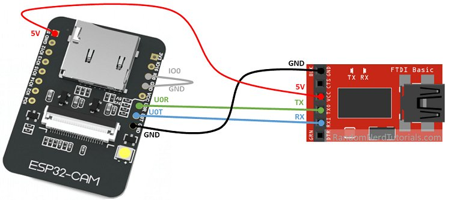

# Documentation for ESP32-Camera Meter Reading Project
Documentation and usage guide for ESP32-Camera Meter Reading Project.

## Requirements
### Hardware
For hardware, you only need an ESP32-CAM module and a way to upload code to it (recommend ESP32-CAM-MB but a USB to TTL should also work). There is no need for SD card as this project uses the onboard SPIFFS filesystem for storing recent camera pictures to display to web.

### Software
For ESP32-CAM code, use either PlatformIO or Arduino IDE. If using Arduino IDE make sure to download necessary libraries. On the cloud side, make sure to have an AWS account (be wary without free tier this will cost money).

## AWS Setup
Make sure you have an AWS account. If you only have a root account, create a  The AWS services used are: Rekognition, Lambda, API Gateway, S3, DynamoDB.

## ESP32-Camera Setup
### PlatformIO
Click [here](./PIOSetup.md) for instructions. (personally recommend over ArduinoIDE).

### Arduino IDE
Click [here](./ArduinoSetup.md) for instructions.

When uploading code, if you are using ESP32-CAM-MB then it is as simple as connecting micro-usb to board and ESP32-CAM-MB to ESP32-CAM. If using a USB to TTL then wiring would look something like this:

### Phyiscal Setup
Make sure the ESP32-CAM is pointed to the digital part of the utility meter. Try to get it as close as possible (~4cm). Keep the camera stable and make sure it won't. Try to get good lighting while also avoiding reflection if possible.

