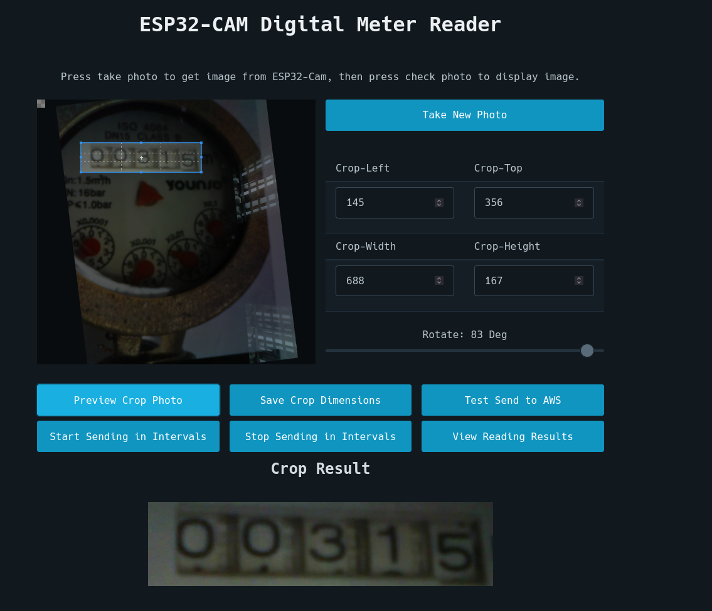

# Website Config

## Instructions
- After uploading the code with whichever framework, the Serial Monitor will display the IP address of the device if successfully connected to Wi-Fi. Go to that IP address in a web browser (eg. `http://192.168.1.29`). Make sure it is HTTP instead of HTTPS. Also make sure you are connected to the same network as the ESP32-CAM.

The website should look something like this:

- The website will show the latest image taken and stored in the ESP32-Camera. To take a new photo, press `take photo` button and to display it on the website, press `check photo` button.

- The image will have a cropping utility. Use the cropping utility to get the region of the photo you want. You can preview what the resulting cropped photo with `preview crop` button.

- Once you are happy with the crop, press `Save Crop Dimension`. This will send the crop information to the ESP32-Camera so that it will forward it to AWS so that AWS can do the image cropping there.

- Then, if you want to send to AWS, press `Send AWS`. Alternatively, the code also has a section to send photos periodically to AWS in the `void loop` part.

## Important Notes
- Remember the website only shows the latest STORED photo, so what the website displays may be different to what the camera actually sees if you moved it. To update it just press the `Take New Picture`.

- Please keep the camera as still as possible. Also, if you cropped the photo and sent the crop dimensions to ESP32-Cam but then changed the camera position later, you most likely need to update the crop dimensions by repeating the process of taking a photo, preview cropping, and sending crop dimensions to update it.